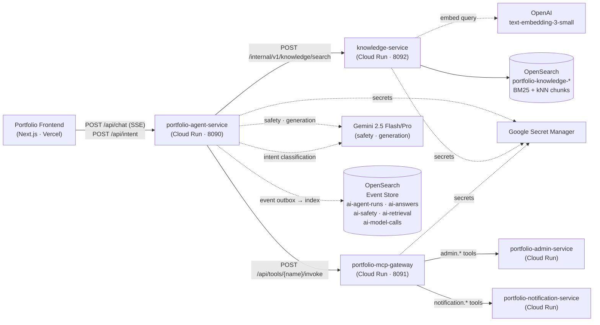
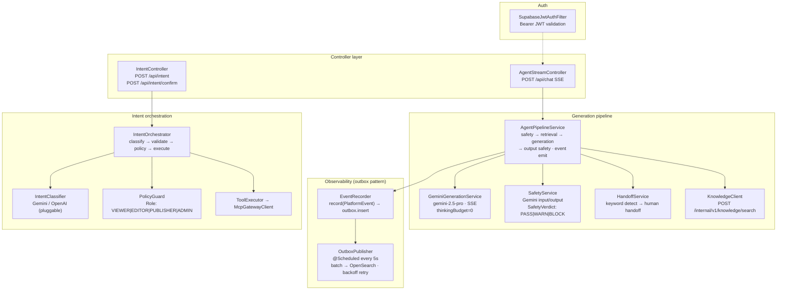

# portfolio-ai-platform

AI orchestration layer for the Portfolio site — three Spring Boot 3.3 / Java 21
microservices on Google Cloud Run.

| Service | Port | Responsibility |
|---|---|---|
| **`portfolio-agent-service`** | 8090 | Full agent pipeline: input safety → retrieval → generation → output safety; SSE streaming; intent classification; RBAC; event observability |
| **`portfolio-mcp-gateway`** | 8091 | Declarative tool catalog, JSON-Schema validation, risk gating, idempotency, domain adapter routing |
| **`knowledge-service`** | 8092 | Hybrid BM25 + kNN search with RRF merge; document ingestion and chunking; OpenAI embeddings |

---

## Architecture



---

## Agent pipeline (portfolio-agent-service)

The critical path for every chat turn:



### Design properties

- **Two-stage safety.** Gemini Flash checks both the raw user input and the draft answer before it reaches the SSE stream. Verdict is `PASS | WARN | BLOCK`; `BLOCK` short-circuits the pipeline and emits a refusal event.
- **Outbox for observability.** `EventRecorder` writes to a local `agent_event_outbox` Postgres table synchronously; a `@Scheduled` publisher flushes batches to OpenSearch with exponential backoff. This decouples the hot chat path from external I/O and gives a natural retry surface for transient OpenSearch downtime.
- **Pluggable intent classifier.** `IntentClassifier` is an interface. `GeminiIntentClassifier` (primary) and `OpenAiIntentClassifier` (fallback) are both wired; swap via `@ConditionalOnProperty`.
- **Risk-gated tool execution.** `PolicyGuard` checks the caller's role before tool dispatch. `RiskLevel: READ_ONLY | SAFE_WRITE | RISKY_WRITE | DESTRUCTIVE` — anything above `SAFE_WRITE` requires explicit confirmation via a pending-action store.

### Event types (6 events per pipeline run → OpenSearch)

| eventType | index prefix | key payload fields |
|---|---|---|
| `agent_run.started` | `ai-agent-runs-*` | question, sessionId, runMode, agentVersion |
| `safety.check_completed` | `ai-safety-*` | verdict (PASS/WARN/BLOCK), checkType, reason |
| `retrieval.completed` | `ai-retrieval-*` | returnedChunks, zeroHit, retrievalStrategy, topK |
| `model_call.completed` | `ai-model-calls-*` | model, provider, outputLength, promptVersion |
| `answer.generated` | `ai-answers-*` | chunksUsed, answerLength, inputSafetyVerdict, outputSafetyVerdict |
| `agent_run.completed` | `ai-agent-runs-*` | finalStatus, latencyMs |

---

## Knowledge retrieval (knowledge-service)

`knowledge-service` owns all KB reads and writes. It is deliberately kept
ignorant of agents and tools — the only contract is the internal HTTP API.

**Search:** `HybridSearchService` issues a BM25 keyword query and a kNN
vector query in parallel, then merges them with Reciprocal Rank Fusion.
`topK`, `visibility`, and `locale` are caller-supplied filters.

**Ingestion:** `IngestionService` applies a sliding-window chunker
(1500 chars / 200 overlap), embeds each chunk with `text-embedding-3-small`
(1536d), then upserts into OpenSearch via `OpenSearchKnowledgeRepository`.

---

## Tool gateway (portfolio-mcp-gateway)

The gateway is a thin, stateless router. It never contains business logic —
all tool semantics live in `tool-catalog.yaml`.

Key responsibilities:
- **Schema validation** (`ParameterValidator`): JSON-Schema type, enum, range, required-field checks before any downstream call.
- **Risk gating** (`RiskGateValidator`): blocks `DESTRUCTIVE` calls without a confirmed pending action; passes `dryRun` invocations through unconditionally.
- **Idempotency** (`IdempotencyKeyService`): Caffeine in-memory cache keyed on `IDEMPOTENCY-KEY` header; safe for at-least-once callers.
- **Domain adapters**: `AdminServiceAdapter`, `NotificationServiceAdapter`, `PortfolioApiAdapter` all extend `AbstractHttpAdapter` — same retry / auth / timeout profile, different base URLs.

---

## Module structure

```
portfolio-ai-platform/
├── shared-contracts/          # PlatformEvent, KnowledgeSearchRequest/Response
│                              # EventTypes constants · KnowledgeChunk
│
├── portfolio-agent-service/
│   └── src/main/java/site/yuqi/agent/
│       ├── controller/        # AgentStreamController · ChatController · IntentController
│       ├── web/               # SupabaseJwtAuthFilter · AuthenticatedPrincipal
│       ├── generation/        # AgentPipelineService · GeminiGenerationService
│       ├── safety/            # SafetyService · SafetyCheckResult · SafetyVerdict
│       ├── handoff/           # HandoffService · HandoffReason
│       ├── observability/     # EventRecorder · OutboxPublisher · OutboxRepository
│       │                      # ObservabilityOpenSearchConfig
│       ├── client/            # KnowledgeClient · McpGatewayClient
│       ├── conversation/      # ConversationService
│       ├── intent/            # IntentOrchestrator · IntentClassifier (interface)
│       │                      # GeminiIntentClassifier · OpenAiIntentClassifier
│       │                      # IntentValidator · EntityResolver · PolicyGuard
│       │                      # ToolRegistry · ToolExecutor · PendingActionStore
│       └── model/             # AgentStreamRequest · ChatRequest · ChatResponse
│                              # ChatStreamEvent · ConversationContext · ToolInvocation
│
├── knowledge-service/
│   └── src/main/java/site/yuqi/knowledge/
│       ├── controller/        # KnowledgeController · IngestionController
│       ├── search/            # HybridSearchService (BM25 + kNN RRF)
│       ├── ingestion/         # IngestionService (chunk + embed + upsert)
│       ├── embedding/         # EmbeddingClient (OpenAI text-embedding-3-small)
│       ├── repository/        # OpenSearchKnowledgeRepository
│       └── config/            # OpenSearchConfig
│
└── portfolio-mcp-gateway/
    └── src/main/java/site/yuqi/mcp/
        ├── controller/        # ToolController
        ├── catalog/           # ToolRegistry (loads tool-catalog.yaml)
        ├── model/             # ToolCatalog · ToolDefinition · RiskLevel
        ├── validation/        # ParameterValidator · RiskGateValidator
        ├── idempotency/       # IdempotencyKeyService
        ├── adapter/           # DomainServiceAdapter (interface)
        │                      # AbstractHttpAdapter · AdminServiceAdapter
        │                      # NotificationServiceAdapter · PortfolioApiAdapter
        │                      # AdapterResolver
        └── audit/             # AuditService
```

---

## Local development

```bash
mvn -B -DskipTests package
docker compose up --build
# Point the frontend: NEXT_PUBLIC_AGENT_SERVICE_URL=http://localhost:8090
```

## Deployment

```bash
gh workflow run deploy-agent-service.yml  --ref main
gh workflow run deploy-mcp-gateway.yml    --ref main
gh workflow run deploy-knowledge-service.yml --ref main
```

See [`.github/workflows/`](.github/workflows/) for the WIF / Artifact Registry / Cloud Run pipelines.

## License

Internal use. © Yuqi Guo.
