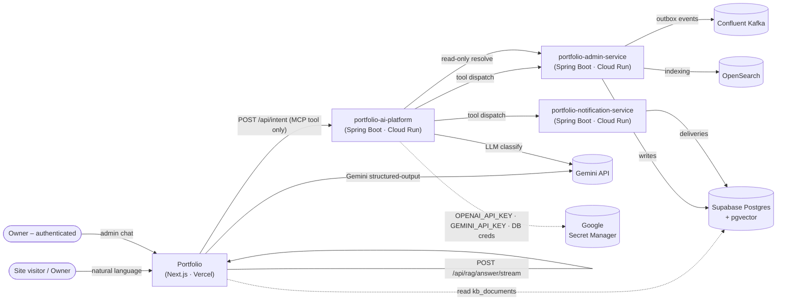
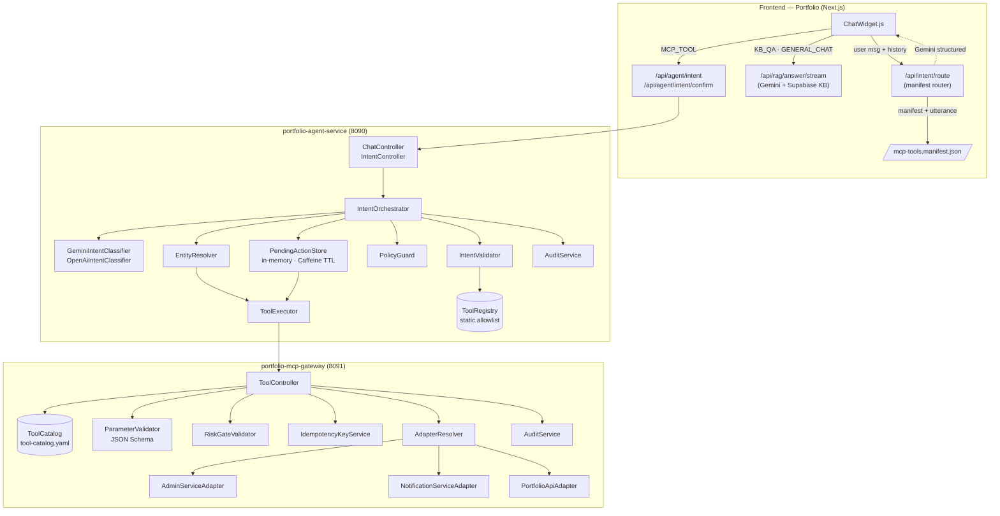
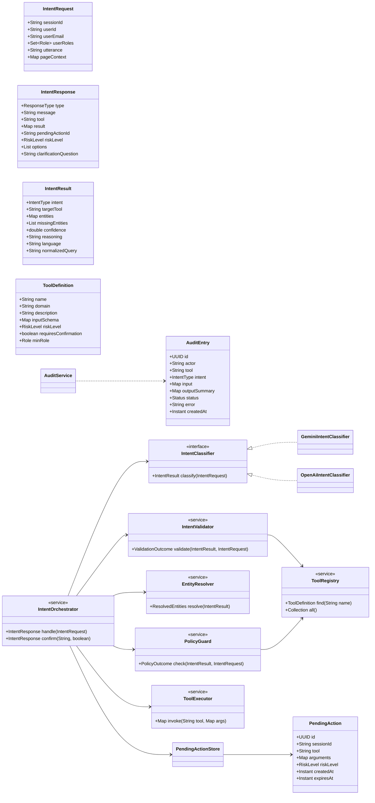
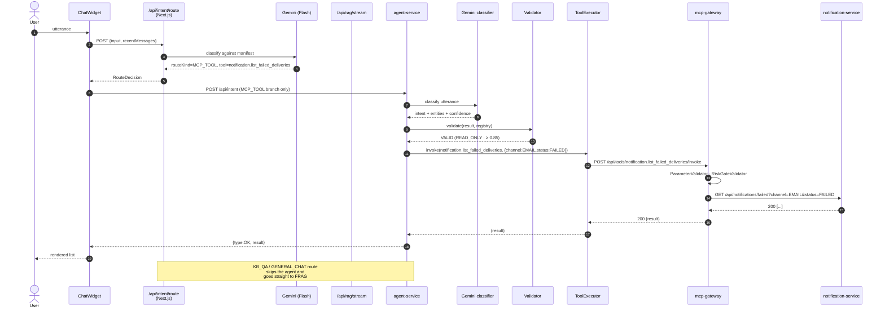
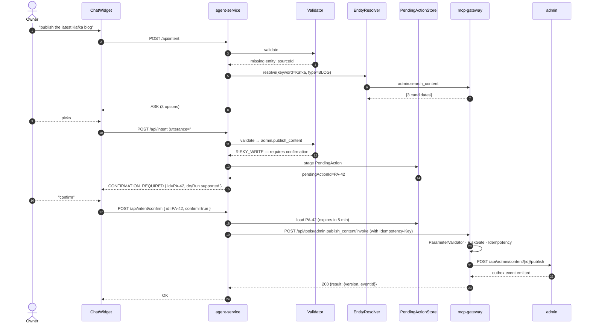
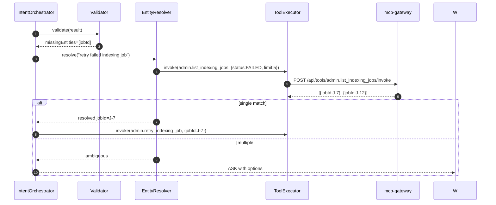
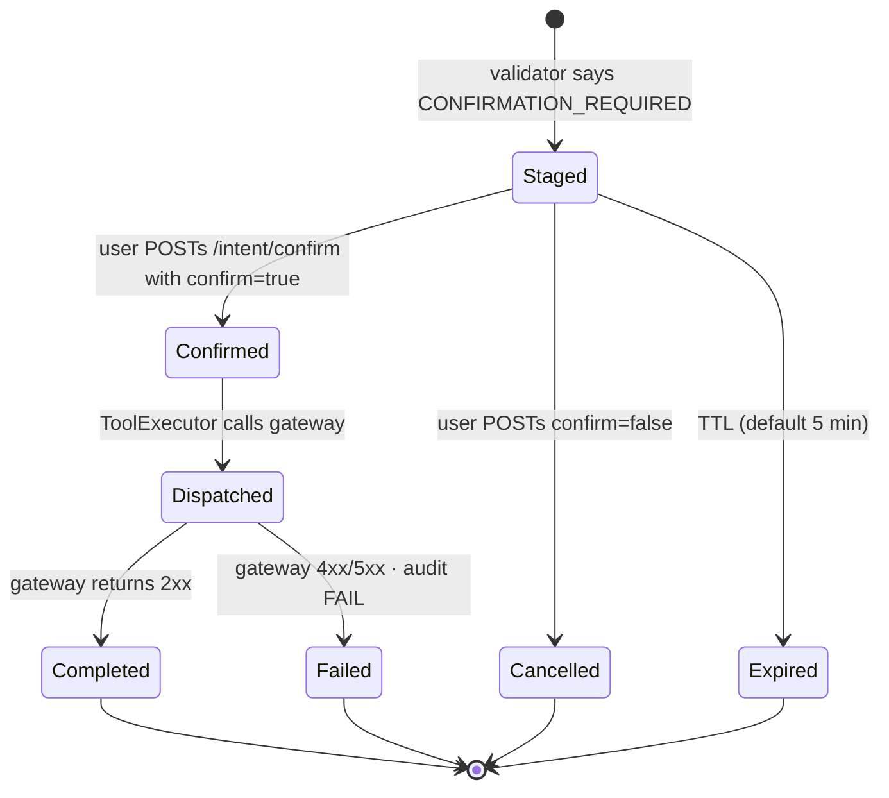
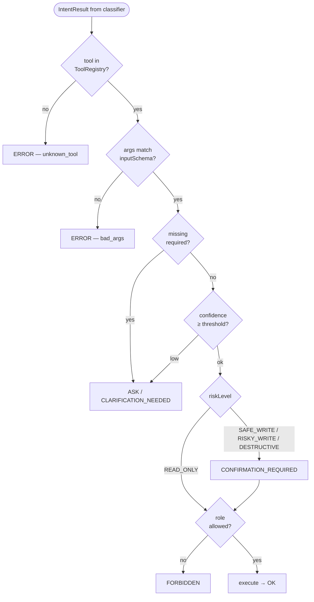

# portfolio-ai-platform

> **Manifest-driven, defense-in-depth AI orchestration layer for the Portfolio
> site.** Two Spring Boot 3.3 services on Java 21, deployed to Google Cloud
> Run, fronted by a Next.js Vercel frontend that runs its own first-pass
> intent router on Gemini Flash.

| Service | Port | Role |
|---|---|---|
| **`portfolio-agent-service`** | 8090 | Receives natural-language utterances. Runs an LLM-first intent classifier (Gemini 2.5 Flash by default, OpenAI as a conditional backup), validates the LLM output deterministically, resolves missing entities via read-only lookups, enforces RBAC + risk policy, and dispatches **one** tool call through the gateway. |
| **`portfolio-mcp-gateway`** | 8091 | Loads a declarative `tool-catalog.yaml`, validates parameters against JSON Schema, enforces risk gates + idempotency, audits every call, and forwards into the domain services (`Portfolio` Next.js, `portfolio-admin-service`, `portfolio-notification-service`). |

See [README.legacy.md](./README.legacy.md) for the original Sprint-1 walkthrough.

---

## Table of contents

1. [Hard rules](#hard-rules)
2. [Architecture (C4 view)](#architecture-c4-view)
   1. [Level 1 — System context](#level-1--system-context)
   2. [Level 2 — Containers](#level-2--containers)
   3. [Level 3 — Components](#level-3--components)
3. [Domain model (UML class diagram)](#domain-model-uml-class-diagram)
4. [Runtime sequences](#runtime-sequences)
   1. [Read-only path](#read-only-path)
   2. [Write path with confirmation](#write-path-with-confirmation)
   3. [Entity-resolution path](#entity-resolution-path)
5. [PendingAction state machine](#pendingaction-state-machine)
6. [Routing decision matrix](#routing-decision-matrix)
7. [Tool catalog](#tool-catalog)
8. [API contracts](#api-contracts)
9. [Audit](#audit)
10. [Local development](#local-development)
11. [Deployment](#deployment)
12. [Operability runbook](#operability-runbook)

---

## Hard rules

These are invariants. Any change that breaks one of them must be reviewed
at the architecture level.

| # | Rule | Enforced by |
|---|---|---|
| 1 | **No regex intent routing.** The LLM picks a tool from a declarative manifest; deterministic code validates the result. | `IntentClassifier`, `IntentValidator` |
| 2 | **LLM only classifies + extracts entities.** It never executes a tool, queries a DB, or assembles a Kafka payload. | `IntentOrchestrator`, `ToolExecutor` |
| 3 | **Every LLM output is revalidated** against the static `ToolRegistry` before any side effect. | `IntentValidator` |
| 4 | **Anonymous IDs are never invented.** Missing `sourceId` / `jobId` / `subscriberId` / `recipientId` / `email` → `CLARIFICATION_NEEDED` or `EntityResolver` lookup. | `IntentValidator`, `EntityResolver` |
| 5 | **Every non-`READ_ONLY` tool requires explicit confirmation.** The agent stages a `PendingAction`; the user POSTs `pendingActionId` + `confirm` to a separate endpoint. | `PendingActionStore`, `IntentOrchestrator.confirm()` |
| 6 | **`RISKY_WRITE` / `DESTRUCTIVE` writes also support `dryRun: true`** at the gateway. | `ToolController`, `RiskGateValidator` |
| 7 | **The gateway never writes Supabase tables directly and never assembles Kafka payloads.** All publish / reindex / retry calls forward to `portfolio-admin-service`, which owns event emission. | `AdminServiceAdapter` |
| 8 | **Every classification, validation, clarification, confirmation, and execution is audited** (SLF4J JSON lines today; Supabase `mcp_tool_audit_logs` table when Sprint 2 lands). | `AuditService` (both services) |
| 9 | **Secrets are pulled from Google Secret Manager**, never baked into env vars or images. | `application.yml` Spring Cloud GCP integration |

---

## Architecture (C4 view)

### Level 1 — System context



### Level 2 — Containers



### Level 3 — Components

```mermaid
flowchart LR
    subgraph orchestrator["IntentOrchestrator"]
        h1["handle(IntentRequest)"]
        h2["confirm(pendingActionId, confirm)"]
    end

    subgraph classifier["IntentClassifier (interface)"]
        gem[GeminiIntentClassifier<br/>responseSchema · temp=0]
        oai[OpenAiIntentClassifier<br/>JSON mode · backup]
    end

    subgraph validator["IntentValidator"]
        v1[toolMustExist]
        v2[argsMatchSchema]
        v3[forceRiskFromManifest]
        v4[confidenceThreshold]
        v5[demoteOnMissingRequired]
    end

    subgraph guard["PolicyGuard"]
        g1[checkRole]
        g2[needsConfirmation]
        g3[rateLimit]
    end

    subgraph executor["ToolExecutor"]
        e1[POST /api/tools/{name}/invoke]
        e2[bearer = MCP_GATEWAY_INTERNAL_TOKEN]
        e3[retry · circuit breaker]
    end

    h1 --> classifier
    h1 --> validator
    h1 --> resolve[EntityResolver]
    h1 --> guard
    h1 -->|"non-READ_ONLY"| store[PendingActionStore]
    h1 -->|"READ_ONLY"| executor
    h2 --> store
    h2 --> executor
```

---

## Domain model (UML class diagram)



---

## Runtime sequences

### Read-only path

> *"List the failed email notifications."*



### Write path with confirmation

> *"Publish the latest Kafka blog."*



### Entity-resolution path



---

## PendingAction state machine



---

## Routing decision matrix

`IntentValidator` is the single arbiter that maps an LLM result to a
response type. The rules are deterministic and never consult the model:



Confidence thresholds (overridable via env):

| Risk | Confidence policy |
|---|---|
| `READ_ONLY` | `≥ 0.85` execute · `0.65–0.85` may clarify · `< 0.65` clarify |
| `SAFE_WRITE` | always require confirmation · `< 0.65` clarify |
| `RISKY_WRITE` | always require confirmation · never auto-execute |
| `DESTRUCTIVE` | always require confirmation + `ADMIN` role |

Env knobs: `MCP_INTENT_CONFIDENCE_READ_THRESHOLD`,
`MCP_INTENT_CONFIDENCE_CLARIFY_THRESHOLD`.

---

## Tool catalog

Declared once in
[`portfolio-mcp-gateway/src/main/resources/tool-catalog.yaml`](portfolio-mcp-gateway/src/main/resources/tool-catalog.yaml)
and mirrored in
[`portfolio-agent-service/.../ToolRegistry.java`](portfolio-agent-service/src/main/java/site/yuqi/agent/intent/ToolRegistry.java)
(the agent's static allowlist), and a third time in the
[`Portfolio/src/lib/mcp-tools.manifest.json`](https://github.com/YuqiGuo105/Portfolio/blob/main/src/lib/mcp-tools.manifest.json)
file consumed by the frontend router. Drift between the three is the #1
source of correctness bugs.

| Tool | Risk | Min role | Target |
|---|---|---|---|
| `admin.search_content` | READ_ONLY | VIEWER | admin |
| `admin.get_content` | READ_ONLY | VIEWER | admin |
| `admin.list_indexing_jobs` | READ_ONLY | VIEWER | admin |
| `admin.list_outbox_events` | READ_ONLY | VIEWER | admin |
| `admin.create_content_draft` | SAFE_WRITE | EDITOR | admin |
| `admin.update_content` | SAFE_WRITE | EDITOR | admin |
| `admin.publish_content` | RISKY_WRITE | PUBLISHER | admin (Kafka owner) |
| `admin.reindex_rag` | RISKY_WRITE | PUBLISHER | admin (Kafka owner) |
| `admin.reindex_search` | RISKY_WRITE | PUBLISHER | admin (Kafka owner) |
| `admin.retry_indexing_job` | SAFE_WRITE | ADMIN | admin |
| `notification.get_delivery_stats` | READ_ONLY | VIEWER | notification |
| `notification.list_subscribers` | READ_ONLY | ADMIN | notification |
| `notification.get_subscriber` | READ_ONLY | ADMIN | notification |
| `notification.list_notifications` | READ_ONLY | VIEWER | notification |
| `notification.list_failed_deliveries` | READ_ONLY | VIEWER | notification |
| `notification.retry_failed_delivery` | SAFE_WRITE | ADMIN | notification |
| `notification.send_test_notification` | SAFE_WRITE | ADMIN | notification |
| `notification.update_subscription` | SAFE_WRITE | ADMIN | notification |
| `notification.unsubscribe_subscriber` | DESTRUCTIVE | ADMIN | notification |

Role inheritance: `ADMIN ⟶ PUBLISHER ⟶ EDITOR ⟶ VIEWER`.

---

## API contracts

### `POST /api/intent` (agent-service)

```json
{
  "sessionId": "abc-123",
  "userId": "u-42",
  "userEmail": "admin@example.com",
  "userRoles": "VIEWER,EDITOR,ADMIN",
  "utterance": "帮我看看 email 有没有失败",
  "pageContext": { "page": "/admin" }
}
```

Response `type` values:

| type | meaning |
|---|---|
| `OK` | tool executed; `result` holds the payload |
| `ASK` | clarification needed; `message` + optional `options` |
| `CONFIRMATION_REQUIRED` | write staged; reply with `pendingActionId` + `confirm: true` to `/api/intent/confirm` |
| `FORBIDDEN` | role lacked permission |
| `GENERAL_CHAT` | small-talk / out of tool scope — frontend should fall back to RAG |
| `ERROR` | validation or upstream failure |

### `POST /api/intent/confirm`

```json
{ "sessionId": "abc-123", "pendingActionId": "uuid", "confirm": true }
```

### `POST /api/tools/{name}/invoke` (gateway, internal)

```http
POST /api/tools/admin.publish_content/invoke
Authorization: Bearer <MCP_GATEWAY_INTERNAL_TOKEN>
Idempotency-Key: <uuid>
Content-Type: application/json

{ "sourceType": "BLOG", "sourceId": "blog-42", "dryRun": false }
```

---

## Audit

Sprint 1: SLF4J JSON lines. Sprint 2: Supabase table.

```sql
create table if not exists mcp_tool_audit_logs (
  id uuid primary key default gen_random_uuid(),
  actor text,
  tool_name text not null,
  intent text,
  input jsonb,
  output_summary jsonb,
  status text not null,
  error text,
  created_at timestamptz default now()
);
create index on mcp_tool_audit_logs (tool_name, created_at desc);
create index on mcp_tool_audit_logs (actor, created_at desc);
```

Redacted keys (never logged): `apiKey`, `api_key`, `authorization`,
`token`, `secret`, `password`, `serviceRoleKey`, `service_role_key`,
`openaiApiKey`, `openai_api_key`, `geminiApiKey`, `gemini_api_key`, `otp`.

---

## Local development

```bash
# Build the multi-module workspace
mvn -B -DskipTests package

# Run both services with Docker
docker compose up --build

# Point the Portfolio frontend at the local agent:
#   NEXT_PUBLIC_AGENT_SERVICE_URL=http://localhost:8090
```

### `portfolio-agent-service` HTTP surface

| Route | Description |
|---|---|
| `POST /api/chat` | SSE stream (legacy ChatWidget direct hook) |
| `POST /api/intent` | JSON intent (testing / Portfolio proxy) |
| `POST /api/intent/confirm` | Confirmation leg of a write |
| `GET  /api/health` | Liveness |

### `portfolio-mcp-gateway` HTTP surface (internal-only)

| Route | Description |
|---|---|
| `POST /api/tools/{name}/invoke` | Dispatch a single tool |
| `GET  /api/tools` | List the catalog |
| `GET  /api/health` | Liveness |

### Switching LLM provider locally

```yaml
# application.yml
agent:
  intent:
    provider: ${AGENT_INTENT_PROVIDER:gemini}   # or 'openai'
    gemini:
      model: ${GEMINI_INTENT_MODEL:gemini-2.5-flash}
    openai:
      model: ${OPENAI_INTENT_MODEL:gpt-4o-mini}
```

The `IntentClassifier` interface has two `@ConditionalOnProperty`
implementations; only one bean is active at a time.

---

## Deployment

Two independent GitHub Actions workflows under `.github/workflows/` deploy
each service to Cloud Run (`us-central1`, project `portfolio-notify-prod`)
using Workload Identity Federation → Artifact Registry → `gcloud run deploy`.

```bash
gh workflow run deploy-agent-service.yml --ref main
gh workflow run deploy-mcp-gateway.yml   --ref main
```

### GitHub repository variables expected

| Variable | Used by | Example |
|---|---|---|
| `GCP_PROJECT_ID` | both | `portfolio-notify-prod` |
| `GCP_REGION` | both | `us-central1` |
| `ARTIFACT_REPO` | both | `portfolio` |
| `WIF_PROVIDER` | both | `projects/.../providers/...` |
| `DEPLOYER_SA_EMAIL` | both | `gh-deployer@…iam.gserviceaccount.com` |
| `AGENT_RUNTIME_SA_EMAIL` | agent | `agent-runtime@…` |
| `GATEWAY_RUNTIME_SA_EMAIL` | gateway | `gateway-runtime@…` |
| `ALLOWED_ORIGINS` | both | `https://www.yuqi.site,https://yuqi.site` |
| `MCP_GATEWAY_BASE_URL` | agent | `https://portfolio-mcp-gateway-XXXX-uc.a.run.app` |
| `AGENT_INTENT_PROVIDER` | agent | `gemini` (default) or `openai` |
| `GEMINI_INTENT_MODEL` | agent | `gemini-2.5-flash` |
| `GEMINI_INTENT_ESCALATION_MODEL` | agent | *(unset)* |
| `OPENAI_INTENT_MODEL` | agent | `gpt-4o-mini` |
| `OPENAI_INTENT_ESCALATION_MODEL` | agent | `gpt-4o` *(optional)* |
| `PORTFOLIO_BASE_URL` | gateway | `https://www.yuqi.site` |
| `ADMIN_SERVICE_BASE_URL` | gateway | `https://portfolio-admin-service-XXXX-uc.a.run.app` |
| `NOTIFICATION_SERVICE_BASE_URL` | gateway | `https://portfolio-notification-service-XXXX-uc.a.run.app` |

### Google Secret Manager secrets

Create as secrets (NOT plain env vars) and grant runtime SAs
`Secret Manager Secret Accessor`:

| Secret | Used by | Notes |
|---|---|---|
| `GEMINI_API_KEY` | agent | classifier credentials (current default) |
| `OPENAI_API_KEY` | agent | optional backup classifier |
| `MCP_GATEWAY_INTERNAL_TOKEN` | both | agent → gateway bearer auth |
| `NOTIFICATION_INTERNAL_TOKEN` | gateway | gateway → notification-service |
| `SPRING_DATASOURCE_URL` | gateway | Supabase JDBC URL (Flyway disabled) |
| `SPRING_DATASOURCE_USERNAME` | gateway | shared with admin-service |
| `SPRING_DATASOURCE_PASSWORD` | gateway | shared with admin-service |

---

## Operability runbook

### Health probes

```bash
curl -fsS https://portfolio-agent-service-XXXX-uc.a.run.app/api/health
curl -fsS https://portfolio-mcp-gateway-XXXX-uc.a.run.app/api/health
```

### "Classifier is slow / 502" symptoms

The Portfolio frontend front-loads its own Gemini router with a 5 s
timeout. If you see the user-facing timeline card "Routing: classifier
unreachable → falling back to KB", check in order:

1. Cloud Run agent-service revision is healthy (`gcloud run services describe`)
2. `GEMINI_API_KEY` secret is mounted and not rotated past expiry
3. `portfolio-mcp-gateway` reachable from agent (`/api/health` from the
   agent container)
4. Gemini API region not throttling — `gcloud logging read` for 429s

### Backing off an OpenAI quota outage

```bash
# Flip provider to gemini via env override and redeploy
gh workflow run deploy-agent-service.yml \
  --ref main \
  -f AGENT_INTENT_PROVIDER=gemini
```

The `OpenAiIntentClassifier` bean is conditional on
`agent.intent.provider=openai` — the wiring just won't load.

### Replaying a failed tool call

`AuditService` writes the original `input` JSON. Pull it from the audit
sink (logs today; `mcp_tool_audit_logs` table after Sprint 2), regenerate
the `Idempotency-Key`, and `curl` directly against the gateway.

---

## Multilingual examples

| Input | Classifier output | Validator verdict |
|---|---|---|
| `帮我找 Kafka 相关的文章` | `admin.search_content` · `keyword=Kafka` · zh · 0.92 | `OK` (READ_ONLY ≥ 0.85) |
| `check if email notification failed` | `notification.list_failed_deliveries` · `{channel:EMAIL,status:FAILED}` · 0.91 | `OK` |
| `发布最新那篇 Kafka blog` | `admin.publish_content` · missing `sourceId` | `CLARIFICATION_NEEDED` → `EntityResolver` runs `admin.search_content` |
| `重试那个失败的 indexing job` | `admin.retry_indexing_job` · missing `jobId` | `CLARIFICATION_NEEDED` → resolver runs `admin.list_indexing_jobs(status=FAILED)` |
| `what's the weather today` | `GENERAL_CHAT` · 0.99 | `GENERAL_CHAT` (out of scope; frontend falls back to RAG) |

---

## License

Internal use. © Yuqi Guo.
