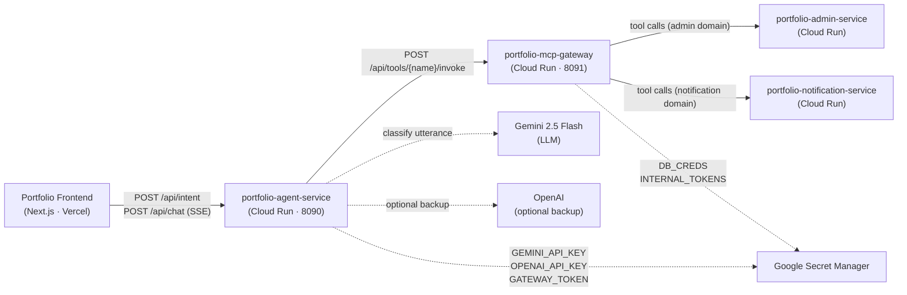
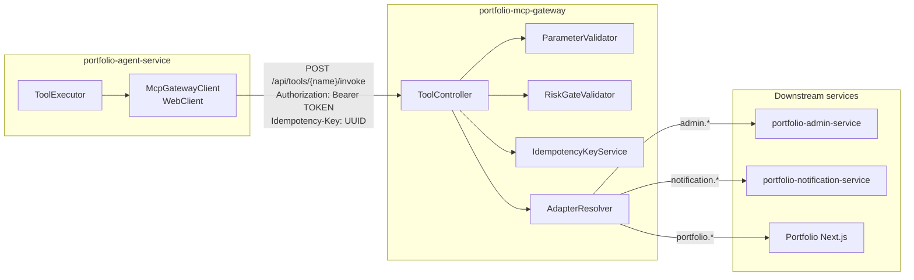
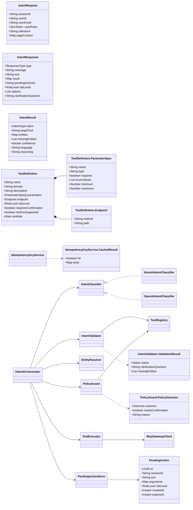

# portfolio-ai-platform

AI orchestration layer for the Portfolio site. Two Spring Boot 3.3 / Java 21
microservices on Google Cloud Run.

| Service | Port | Role |
|---|---|---|
| **`portfolio-agent-service`** | 8090 | LLM intent classification, entity resolution, RBAC, pending-action staging, tool dispatch |
| **`portfolio-mcp-gateway`** | 8091 | Declarative tool catalog, JSON-Schema validation, risk gating, idempotency, domain adapter routing |

---

## System design — component diagrams

### 1 · System context



---

### 2 · portfolio-agent-service — component diagram

```mermaid
flowchart TB
    subgraph controllers["Controller layer"]
        CC["ChatController\nPOST /api/chat (SSE)"]
        IC["IntentController\nPOST /api/intent\nPOST /api/intent/confirm"]
    end

    subgraph orchestration["Orchestration core"]
        IO["IntentOrchestrator\n@Service\n#handle(IntentRequest)\n#confirm(id, bool)"]
    end

    subgraph classifier["Classifier (strategy pattern)"]
        IFC["«interface»\nIntentClassifier\n#classify()\n#escalate()"]
        GEMCLS["GeminiIntentClassifier\n@ConditionalOnProperty(provider=gemini)\nresponseSchema · thinkingBudget=0"]
        OAICLS["OpenAiIntentClassifier\n@ConditionalOnProperty(provider=openai)\nJSON mode · gpt-4o-mini"]
    end

    subgraph validation["Validation & policy"]
        IV["IntentValidator\n@Component\nStatus: EXECUTE|CLARIFY|GENERAL_CHAT|REJECT\n· toolMustExist\n· argsMatchSchema\n· forceRiskFromManifest\n· confidenceThreshold\n· demoteOnMissingRequired"]
        PG["PolicyGuard\n@Component\nRole: VIEWER|EDITOR|PUBLISHER|ADMIN\nPolicyDecision: ALLOWED|FORBIDDEN|NEEDS_CONFIRM"]
    end

    subgraph resolution["Entity resolution"]
        ER["EntityResolver\n@Component\nOutcome: READY|CLARIFY|GATEWAY_ERR\nEntityResolutionResult"]
    end

    subgraph execution["Execution & state"]
        TR["ToolRegistry\n@Component\nstatic allowlist → Map·ToolDefinition·"]
        PAS["PendingActionStore\n@Component\nCaffeine TTL cache\nstage() / load() / expire()"]
        TE["ToolExecutor\n@Service\ninvoke(tool, args) → Map\nbearer = GATEWAY_TOKEN"]
        MGC["McpGatewayClient\nWebClient wrapper\nresilience4j retry"]
    end

    subgraph audit["Audit"]
        AS2["AuditService\n@Service\nSLF4J JSON lines\nlogClassify · logExecute · logError"]
    end

    subgraph models["Models"]
        IREQ["IntentRequest\nsessionId · userId\nuserEmail · userRoles\nutterance · pageContext"]
        IRES["IntentResponse\ntype · message · tool\nresult · pendingActionId\nriskLevel · options"]
        IRSLT["IntentResult\nintent · targetTool\nentities · missingEntities\nconfidence · language"]
        PA["PendingAction\nid · sessionId · tool\narguments · riskLevel\ncreatedAt · expiresAt"]
    end

    CC --> IO
    IC --> IO
    IO --> IFC
    IFC <|.. GEMCLS
    IFC <|.. OAICLS
    IO --> IV
    IV --> TR
    IO --> ER
    ER --> TE
    IO --> PG
    PG --> TR
    IO --> PAS
    PAS --> PA
    IO --> TE
    TE --> MGC
    IO --> AS2
    IO ..> IREQ
    IO ..> IRES
    IO ..> IRSLT
```

---

### 3 · portfolio-mcp-gateway — component diagram

```mermaid
flowchart TB
    subgraph controller["Controller layer"]
        TC["ToolController\n@RestController\nPOST /api/tools/{name}/invoke\nGET  /api/tools\nGET  /api/health"]
    end

    subgraph catalog["Catalog / registry"]
        TR["ToolRegistry\n@Component\nloads tool-catalog.yaml on startup\nfind(name) → ToolDefinition\nall() → Collection"]
        TCAT["ToolCatalog\nYAML root wrapper\nList·ToolDefinition·"]
        TD["ToolDefinition\nname · domain · description\nParameterSpec[] · Endpoint\nRiskLevel · requiresConfirmation\ndryRunSupported · minRole"]
    end

    subgraph validation["Validation pipeline"]
        PV["ParameterValidator\n@Component\nJSON-Schema type check\nenum · minimum/maximum\nrequired fields\nValidationResult"]
        RGV["RiskGateValidator\n@Component\nRiskLevel: READ_ONLY|SAFE_WRITE\n         RISKY_WRITE|DESTRUCTIVE\ndryRun passthrough"]
    end

    subgraph idempotency["Idempotency"]
        IKS["IdempotencyKeyService\n@Service\nCaffeine in-memory (Sprint 1)\nCachedResult: HIT|MISS\nIDEMPOTENCY-KEY header"]
    end

    subgraph adapters["Adapter layer (strategy pattern)"]
        AR["AdapterResolver\n@Component\ndomain → DomainServiceAdapter"]
        DSA["«interface»\nDomainServiceAdapter\ninvoke(tool, args) → Map"]
        AHA["AbstractHttpAdapter\nimplements DomainServiceAdapter\nWebClient · baseUrl() · timeout()\nauthHeaders() · retries"]
        ADMA["AdminServiceAdapter\n@Component extends AbstractHttpAdapter\nadmin.* tools → /api/admin/**"]
        NOTIFA["NotificationServiceAdapter\n@Component extends AbstractHttpAdapter\nnotification.* tools → /api/notifications/**"]
        PORTA["PortfolioApiAdapter\n@Component extends AbstractHttpAdapter\nportfolio.* tools → /api/**"]
    end

    subgraph audit["Audit"]
        AUDS["AuditService\n@Service\nSLF4J structured JSON\nlogInvoke · logResult · logError\nredact secrets"]
    end

    TC --> TR
    TC --> PV
    TC --> RGV
    TC --> IKS
    TC --> AR
    TC --> AUDS
    TR --> TCAT
    TCAT --> TD
    AR --> DSA
    DSA <|.. AHA
    AHA <|-- ADMA
    AHA <|-- NOTIFA
    AHA <|-- PORTA
```

---

### 4 · Cross-service interaction (component level)



---

### 5 · Data model



---

## Module structure

```
portfolio-ai-platform/
├── portfolio-agent-service/
│   └── src/main/java/site/yuqi/agent/
│       ├── controller/        # ChatController · IntentController
│       ├── intent/            # IntentOrchestrator · IntentClassifier (interface)
│       │                      # GeminiIntentClassifier · OpenAiIntentClassifier
│       │                      # IntentValidator · EntityResolver · PolicyGuard
│       │                      # ToolRegistry · ToolExecutor · PendingActionStore
│       │                      # AuditService · PendingAction · ToolDefinition
│       │                      # IntentRequest · IntentResponse · IntentResult
│       ├── model/             # ChatRequest · ChatResponse · ChatStreamEvent
│       │                      # ConversationContext · ToolInvocation
│       ├── service/           # GraphWorkflowRunner
│       └── client/            # McpGatewayClient
│
└── portfolio-mcp-gateway/
    └── src/main/java/site/yuqi/mcp/
        ├── controller/        # ToolController
        ├── registry/          # ToolRegistry (loads tool-catalog.yaml)
        ├── model/             # ToolCatalog · ToolDefinition · RiskLevel · ToolMode
        ├── validation/        # ParameterValidator
        ├── security/          # RiskGateValidator
        ├── idempotency/       # IdempotencyKeyService
        ├── adapter/           # DomainServiceAdapter (interface)
        │                      # AbstractHttpAdapter · AdminServiceAdapter
        │                      # NotificationServiceAdapter · PortfolioApiAdapter
        │                      # AdapterResolver
        └── audit/             # AuditService
```

---

## Local development

```bash
mvn -B -DskipTests package
docker compose up --build
# Point the frontend: NEXT_PUBLIC_AGENT_SERVICE_URL=http://localhost:8090
```

## Deployment

```bash
gh workflow run deploy-agent-service.yml --ref main
gh workflow run deploy-mcp-gateway.yml   --ref main
```

See [`.github/workflows/`](.github/workflows/) for the full WIF / Artifact Registry / Cloud Run deploy pipelines.

## License

Internal use. © Yuqi Guo.
