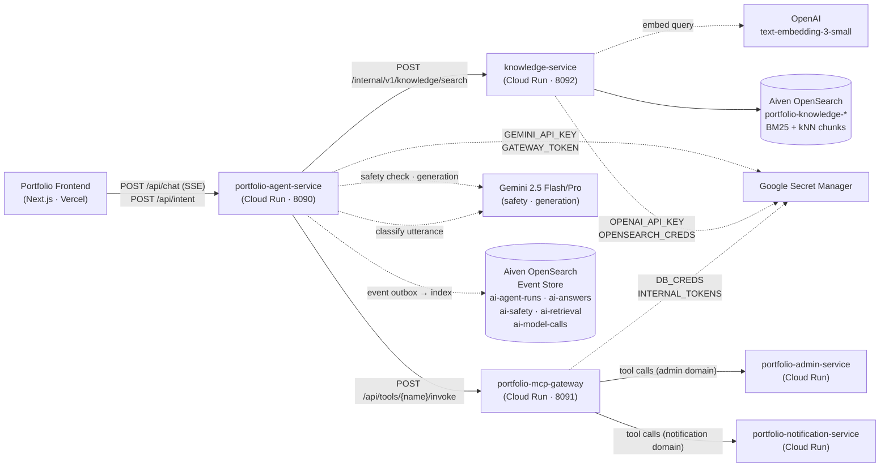
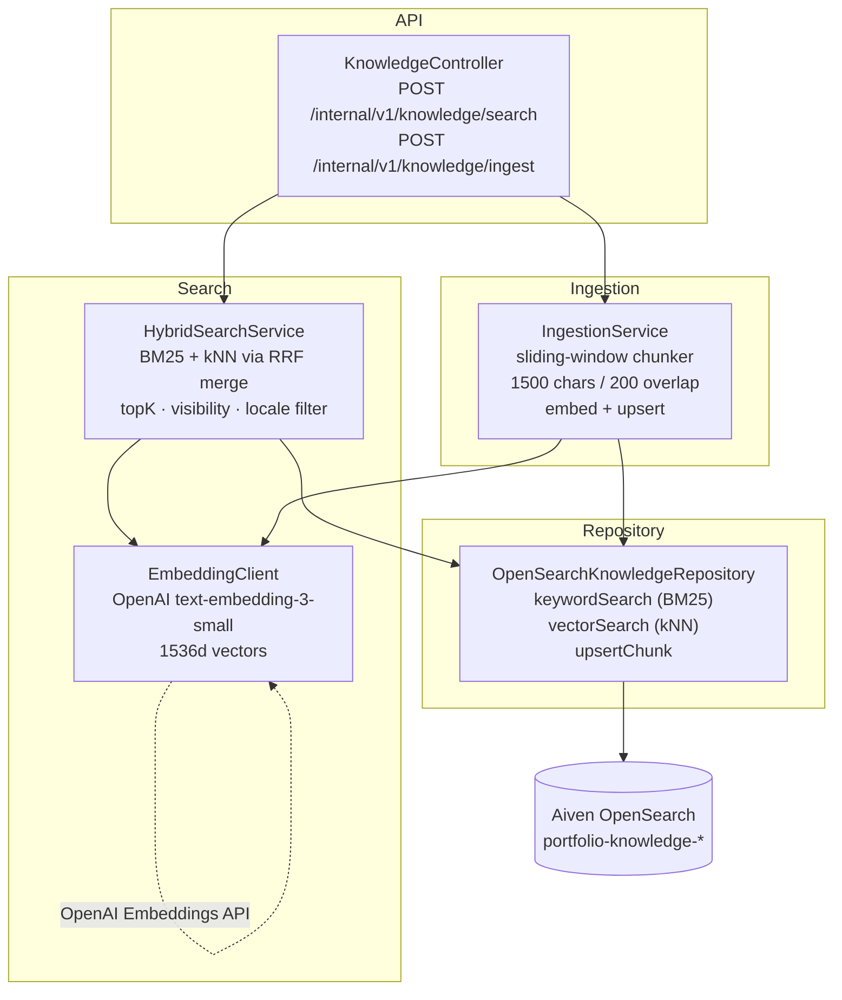
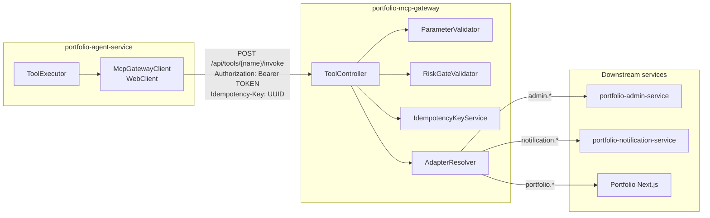
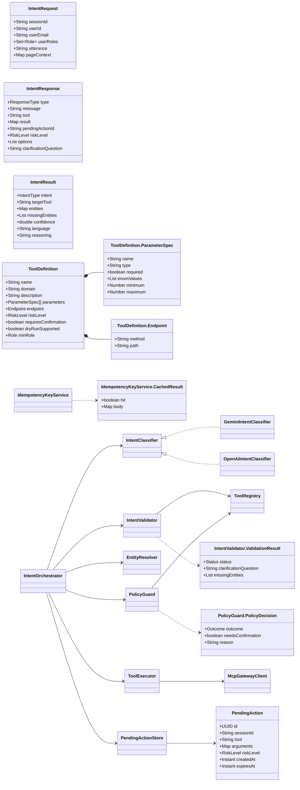

# portfolio-ai-platform

AI orchestration layer for the Portfolio site. Three Spring Boot 3.3 / Java 21
microservices on Google Cloud Run.

## Architecture docs

- [AI Customer Agent Platform + Aiven OpenSearch 实施方案](docs/ai-customer-agent-opensearch-plan.zh.md)

| Service | Port | Role |
|---|---|---|
| **`portfolio-agent-service`** | 8090 | Full agent pipeline: input safety → knowledge retrieval → LLM generation → output safety; SSE streaming; intent classification; RBAC; event observability |
| **`portfolio-mcp-gateway`** | 8091 | Declarative tool catalog, JSON-Schema validation, risk gating, idempotency, domain adapter routing |
| **`knowledge-service`** | 8092 | Hybrid BM25 + kNN search with RRF merge; document ingestion and chunking; OpenAI embeddings; Aiven OpenSearch KB |

---

## System design — component diagrams

### 1 · System context



---

### 2 · portfolio-agent-service — component diagram

```mermaid
flowchart TB
    subgraph controllers["Controller layer"]
        ASC["AgentStreamController\nPOST /api/chat (SSE stream)"]
        CC["ChatController\nPOST /api/chat (non-stream)"]
        IC["IntentController\nPOST /api/intent\nPOST /api/intent/confirm"]
    end

    subgraph web["Web / auth"]
        SJF["SupabaseJwtAuthFilter\n@Component\nBearer JWT validation"]
        CS["ConversationService\nconversation history\nsessionId keyed"]
    end

    subgraph pipeline["Generation pipeline"]
        APS["AgentPipelineService\n@Service\nsafety → retrieval → generation\n→ output safety · event emit"]
        GGS["GeminiGenerationService\ngemini-2.5-pro · SSE stream\nthinkingBudget=0"]
        SS["SafetyService\nGemini input/output check\nSafetyVerdict: PASS|WARN|BLOCK"]
        HS["HandoffService\nkeyword detect → human handoff\nHandoffReason enum"]
    end

    subgraph retrieval["Retrieval client"]
        KC["KnowledgeClient\nWebClient wrapper\nPOST /internal/v1/knowledge/search"]
    end

    subgraph observability["Observability (event-driven)"]
        ER2["EventRecorder\n@Service\nrecord(PlatformEvent)\ncategorize → outbox.insert"]
        OP["OutboxPublisher\n@Scheduled every 5s\nclaim batch → POST OpenSearch\nexponential backoff retry"]
        OR["OutboxRepository\n@Repository\ninsert / findPendingBatch\ndead_letter on max retries"]
        OC["ObservabilityOpenSearchConfig\nAiven OS client\nindex routing per event category"]
    end

    subgraph intent["Intent & orchestration"]
        IO["IntentOrchestrator\n@Service\n#handle(IntentRequest)\n#confirm(id, bool)"]
        IFC["«interface» IntentClassifier"]
        GEMCLS["GeminiIntentClassifier\nresponseSchema · thinkingBudget=0"]
        OAICLS["OpenAiIntentClassifier\nJSON mode · gpt-4o-mini"]
        IV["IntentValidator\nStatus: EXECUTE|CLARIFY|GENERAL_CHAT|REJECT"]
        PG["PolicyGuard\nRole: VIEWER|EDITOR|PUBLISHER|ADMIN"]
        ER["EntityResolver\nOutcome: READY|CLARIFY|GATEWAY_ERR"]
        TR["ToolRegistry · PendingActionStore"]
        TE["ToolExecutor → McpGatewayClient"]
        AUDS["AuditService\nSLF4J structured JSON"]
    end

    SJF -.-> ASC
    ASC --> APS
    CS -.-> APS
    APS --> SS
    APS --> KC
    APS --> GGS
    APS --> HS
    APS --> ER2
    ER2 --> OR
    OR --> OP
    OP --> OC

    CC --> IO
    IC --> IO
    IO --> IFC
    IFC <|.. GEMCLS
    IFC <|.. OAICLS
    IO --> IV
    IV --> TR
    IO --> ER
    IO --> PG
    IO --> TE
    IO --> AUDS
```

**Event types emitted per pipeline run (6 events → Aiven OpenSearch):**

| eventType | index prefix | key payload fields |
|---|---|---|
| `agent_run.started` | `ai-agent-runs-*` | question, sessionId, runMode, agentVersion |
| `safety.check_completed` | `ai-safety-*` | verdict (PASS/WARN/BLOCK), checkType, reason |
| `retrieval.completed` | `ai-retrieval-*` | returnedChunks, zeroHit, retrievalStrategy, topK |
| `model_call.completed` | `ai-model-calls-*` | model, provider, outputLength, promptVersion |
| `answer.generated` | `ai-answers-*` | chunksUsed, answerLength, inputSafetyVerdict, outputSafetyVerdict |
| `agent_run.completed` | `ai-agent-runs-*` | finalStatus, latencyMs |

---

### 3 · knowledge-service — component diagram



---

### 4 · portfolio-mcp-gateway — component diagram

```mermaid
flowchart TB
    subgraph controller["Controller layer"]
        TC["ToolController\n@RestController\nPOST /api/tools/{name}/invoke\nGET  /api/tools\nGET  /api/health"]
    end

    subgraph catalog["Catalog / registry"]
        TR["ToolRegistry\n@Component\nloads tool-catalog.yaml on startup\nfind(name) → ToolDefinition\nall() → Collection"]
        TCAT["ToolCatalog\nYAML root wrapper\nList·ToolDefinition·"]
        TD["ToolDefinition\nname · domain · description\nParameterSpec[] · Endpoint\nRiskLevel · requiresConfirmation\ndryRunSupported · minRole"]
    end

    subgraph validation["Validation pipeline"]
        PV["ParameterValidator\n@Component\nJSON-Schema type check\nenum · minimum/maximum\nrequired fields\nValidationResult"]
        RGV["RiskGateValidator\n@Component\nRiskLevel: READ_ONLY|SAFE_WRITE\n         RISKY_WRITE|DESTRUCTIVE\ndryRun passthrough"]
    end

    subgraph idempotency["Idempotency"]
        IKS["IdempotencyKeyService\n@Service\nCaffeine in-memory (Sprint 1)\nCachedResult: HIT|MISS\nIDEMPOTENCY-KEY header"]
    end

    subgraph adapters["Adapter layer (strategy pattern)"]
        AR["AdapterResolver\n@Component\ndomain → DomainServiceAdapter"]
        DSA["«interface»\nDomainServiceAdapter\ninvoke(tool, args) → Map"]
        AHA["AbstractHttpAdapter\nimplements DomainServiceAdapter\nWebClient · baseUrl() · timeout()\nauthHeaders() · retries"]
        ADMA["AdminServiceAdapter\n@Component extends AbstractHttpAdapter\nadmin.* tools → /api/admin/**"]
        NOTIFA["NotificationServiceAdapter\n@Component extends AbstractHttpAdapter\nnotification.* tools → /api/notifications/**"]
        PORTA["PortfolioApiAdapter\n@Component extends AbstractHttpAdapter\nportfolio.* tools → /api/**"]
    end

    subgraph audit["Audit"]
        AUDS["AuditService\n@Service\nSLF4J structured JSON\nlogInvoke · logResult · logError\nredact secrets"]
    end

    TC --> TR
    TC --> PV
    TC --> RGV
    TC --> IKS
    TC --> AR
    TC --> AUDS
    TR --> TCAT
    TCAT --> TD
    AR --> DSA
    DSA <|.. AHA
    AHA <|-- ADMA
    AHA <|-- NOTIFA
    AHA <|-- PORTA
```

---

### 5 · Cross-service interaction (component level)



---

### 6 · Data model



---

## Module structure

```
portfolio-ai-platform/
├── shared-contracts/          # Shared DTOs: PlatformEvent, KnowledgeSearchRequest/Response
│                              # EventTypes constants · KnowledgeChunk
│
├── portfolio-agent-service/
│   └── src/main/java/site/yuqi/agent/
│       ├── controller/        # AgentStreamController · ChatController · IntentController
│       ├── web/               # SupabaseJwtAuthFilter · AuthenticatedPrincipal
│       ├── generation/        # AgentPipelineService · GeminiGenerationService
│       ├── safety/            # SafetyService · SafetyCheckResult · SafetyVerdict
│       ├── handoff/           # HandoffService · HandoffReason
│       ├── observability/     # EventRecorder · OutboxPublisher · OutboxRepository
│       │                      # ObservabilityOpenSearchConfig · ObservabilityOpenSearchProperties
│       ├── client/            # KnowledgeClient · McpGatewayClient
│       ├── conversation/      # ConversationService
│       ├── intent/            # IntentOrchestrator · IntentClassifier (interface)
│       │                      # GeminiIntentClassifier · OpenAiIntentClassifier
│       │                      # IntentValidator · EntityResolver · PolicyGuard
│       │                      # ToolRegistry · ToolExecutor · PendingActionStore
│       │                      # AuditService · PendingAction · ToolDefinition
│       │                      # IntentRequest · IntentResponse · IntentResult
│       ├── service/           # AgentDecision · AgentDecisionEngine · GraphWorkflowRunner
│       └── model/             # AgentStreamRequest · ChatRequest · ChatResponse
│                              # ChatStreamEvent · ConversationContext · ToolInvocation
│
├── knowledge-service/
│   └── src/main/java/site/yuqi/knowledge/
│       ├── controller/        # KnowledgeController · IngestionController
│       ├── search/            # HybridSearchService (BM25 + kNN RRF)
│       ├── ingestion/         # IngestionService (chunk + embed + upsert)
│       ├── embedding/         # EmbeddingClient (OpenAI text-embedding-3-small)
│       ├── repository/        # OpenSearchKnowledgeRepository
│       ├── model/             # KnowledgeChunk
│       └── config/            # OpenSearchConfig
│
└── portfolio-mcp-gateway/
    └── src/main/java/site/yuqi/mcp/
        ├── controller/        # ToolController
        ├── catalog/           # ToolRegistry (loads tool-catalog.yaml)
        ├── model/             # ToolCatalog · ToolDefinition · RiskLevel
        ├── validation/        # ParameterValidator · RiskGateValidator
        ├── idempotency/       # IdempotencyKeyService
        ├── adapter/           # DomainServiceAdapter (interface)
        │                      # AbstractHttpAdapter · AdminServiceAdapter
        │                      # NotificationServiceAdapter · PortfolioApiAdapter
        │                      # AdapterResolver
        └── audit/             # AuditService
```

---

## Local development

```bash
mvn -B -DskipTests package
docker compose up --build
# Point the frontend: NEXT_PUBLIC_AGENT_SERVICE_URL=http://localhost:8090
```

## Deployment

```bash
gh workflow run deploy-agent-service.yml  --ref main
gh workflow run deploy-mcp-gateway.yml    --ref main
gh workflow run deploy-knowledge-service.yml --ref main
```

See [`.github/workflows/`](.github/workflows/) for the full WIF / Artifact Registry / Cloud Run deploy pipelines.

## License

Internal use. © Yuqi Guo.
