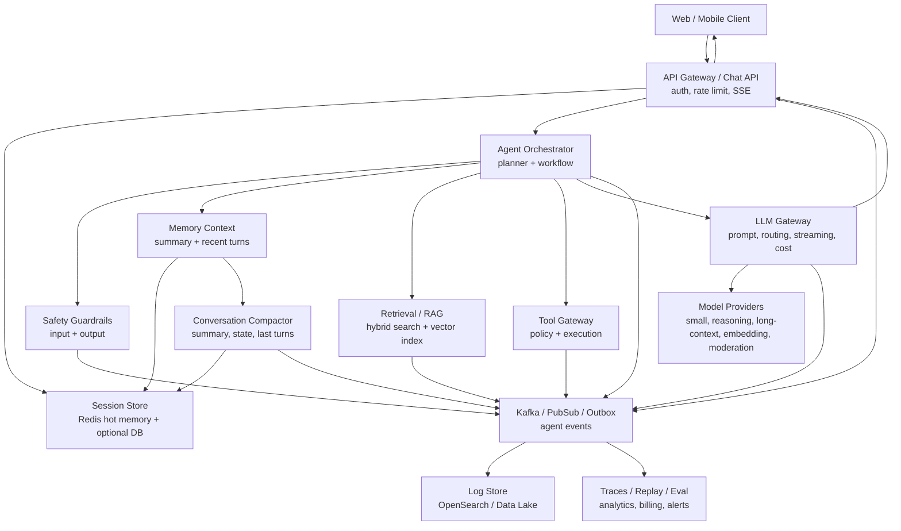
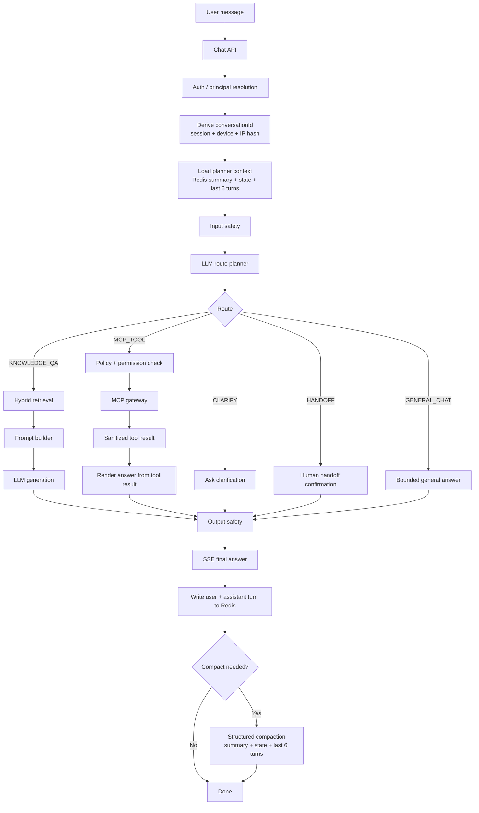

# portfolio-ai-platform

AI platform layer for Yuqi's portfolio: chat serving, agent orchestration,
retrieval, MCP tool execution, safety, memory, and observability.

The repository is intentionally small enough to run locally, but the design is
documented as a production-grade agent platform. The diagram below is the target
service boundary model; the module table maps that model to the current code.

## Service Map

| Module | Port | Current responsibility |
|---|---:|---|
| `portfolio-agent-service` | 8090 | Chat API, SSE streaming, safety checks, route planning, intent orchestration, Redis conversation memory, RAG answer generation, handoff, and event recording |
| `portfolio-mcp-gateway` | 8091 | Tool catalog, schema validation, permission/risk gate, idempotency, audit redaction, and domain adapter routing |
| `knowledge-service` | 8092 | Knowledge ingestion, chunking, embedding, hybrid BM25 + vector retrieval, and OpenSearch-backed KB indexes |
| `shared-contracts` | - | Shared event and knowledge DTOs used across services |

## Reference Architecture



## Current Implementation Mapping

The current repo compresses several logical boxes into three deployable Spring
Boot services:

| Reference component | Current implementation |
|---|---|
| API Gateway | Portfolio frontend / deployment edge plus `SupabaseJwtAuthFilter` in `portfolio-agent-service` |
| Chat API Service | `AgentStreamController`, `ChatController`, `IntentController` |
| Redis Cache / hot history | `RedisConversationStore`, `ConversationContextLoader`, `MemoryWriter`, `ConversationCompactor` |
| Conversation DB | Existing optional Postgres infrastructure is used for operational data and outbox-style observability. Conversation memory is Redis-only in the current sprint; no `conversation_turn` durable history is written. |
| Agent Orchestrator | `AgentPipelineService`, `GraphWorkflowRunner`, `IntentOrchestrator`, `LlmAgentRoutePlanner` |
| Safety Service | `SafetyService` using Gemini moderation-style checks for input and output |
| Retrieval Service / RAG | `knowledge-service` + `KnowledgeClient` |
| Vector DB | OpenSearch BM25 + kNN indexes today; pgvector/Pinecone/Weaviate are compatible future boundaries |
| Tool Gateway | `portfolio-mcp-gateway` |
| LLM Gateway | Currently embedded in agent service via `GeminiGenerationService`, `GeminiIntentClassifier`, and `OpenAiIntentClassifier`; can be extracted later when model routing, cost controls, and retry policies grow |
| Event Bus / Log Store | Postgres outbox plus OpenSearch publisher today; Kafka/PubSub is the production target boundary |

## Hot Path



## Conversation Memory Policy

Memory is deliberately hot and ephemeral in this sprint.

- `conversationId` is derived server-side from `sessionId`, device identifier,
  and IP tiebreaker using SHA-256. The raw identifiers are not reused as the
  Redis key.
- Redis is the only memory store for chat turns and planner context.
- The Redis bucket uses a 30-minute sliding TTL. Every read and write refreshes
  expiry; idle sessions naturally disappear.
- Planner input is bounded:
  `compactSummary + structuredState + last 6 recent turns + pendingAction`.
- The frontend may display a local transcript, but the backend does not depend
  on frontend-supplied conversation memory for planning.
- Tool outputs are sanitized before memory write. Secret-like keys such as
  `apiKey`, `authorization`, `token`, `secret`, `password`, `serviceRoleKey`,
  `openaiApiKey`, and `otp` are redacted.
- Compaction runs asynchronously when turn count, token budget, idle time, or
  tool-result size crosses configured thresholds.

Key classes:

| Class | Role |
|---|---|
| `ConversationKey` | Derives deterministic opaque Redis conversation ids |
| `RedisConversationStore` | Loads, saves, appends, scans Redis memory buckets |
| `ConversationContextLoader` | Builds bounded planner context from Redis |
| `MemoryWriter` | Writes user/assistant turn pairs after terminal events |
| `ConversationCompactor` | Produces structured summaries and keeps recent turns |
| `MemorySanitizer` | Redacts secrets and truncates oversized values |

## Agent Orchestration

The agent service follows a single-planner model. The LLM decides the route, but
server-side code owns validation, authorization, execution, and final safety.

Core rules:

1. The model can classify intent and extract entities; it cannot execute tools.
2. Every model decision is revalidated against the in-code tool registry.
3. Tool execution is gated by role, risk level, and confirmation state.
4. Analytics tools are aggregate-only and must not expose individual visitors,
   emails, IPs, raw session ids, or exact per-user event trails.
5. High-risk, low-confidence, or explicitly human-requested flows move to
   handoff instead of forcing an automated answer.

Important routes:

| Route | Behavior |
|---|---|
| `MCP_TOOL` | Execute an allowed tool through `portfolio-mcp-gateway` after policy checks |
| `KNOWLEDGE_QA` | Search knowledge base and generate a grounded answer |
| `CLARIFY` | Ask for missing intent/entity/time-range information |
| `HANDOFF` | Ask confirmation and create a human support ticket |
| `GENERAL_CHAT` | Return a bounded, portfolio-scoped general response |

## Knowledge Retrieval

`knowledge-service` owns document ingestion and search. It is intentionally
separate from the agent runtime so retrieval quality can evolve independently.

- Ingestion chunks content with overlap, embeds chunks, and upserts to the
  knowledge index.
- Search performs hybrid retrieval: BM25 keyword search plus vector kNN.
- Results are merged with Reciprocal Rank Fusion before the answer prompt is
  built.
- The retrieval service should not execute tools or infer user permissions; it
  only returns candidate knowledge chunks.

## Tool Gateway

`portfolio-mcp-gateway` is a deterministic execution boundary.

- Tool shape is declared in `tool-catalog.yaml`.
- Inputs are checked with schema validation before adapter dispatch.
- Risk gates block unsafe write operations unless the agent has staged and
  confirmed a pending action.
- Idempotency protects callers from retry duplication.
- Audit payloads are redacted before logging or event publication.
- Domain adapters keep business ownership outside the gateway.

The first analytics MCP surface is intentionally narrow:

| Tool | Purpose |
|---|---|
| `analytics.get_visitor_summary` | Aggregate visitor/event summary for a bounded time range |
| `analytics.get_top_pages` | Aggregate page performance |
| `analytics.get_referrer_summary` | Aggregate acquisition/referrer breakdown |

Geo-level analytics should remain a later feature because city-level reporting
has sharper privacy boundaries.

## LLM Gateway Boundary

The current code embeds model calls inside the agent service. The reference
architecture treats LLM Gateway as an extractable boundary once these concerns
need independent scaling:

- prompt construction and versioning
- token budgeting and context packing
- model routing between cheap, reasoning, long-context, embedding, and
  moderation models
- retry and fallback policy
- streaming adaptation back to the Chat API
- cost tracking by route, model, and user/session bucket

## Observability

Every important step should emit structured events with enough context to
replay, debug, and evaluate the system without logging private data.

Recommended event groups:

| Event group | Examples |
|---|---|
| Agent run | run started/completed, selected route, latency, final status |
| Safety | input verdict, output verdict, risk reason |
| Retrieval | query, topK, returned chunks, zero-hit flag, latency |
| Tool | target tool, risk level, policy result, sanitized outcome summary |
| Model | provider, model, prompt profile, token estimate, latency |
| Memory | memory loaded, compaction triggered, compacted turn count |

OpenSearch is the current log-store target. Kafka/PubSub, replay, eval,
analytics, billing, and alerting are documented as production platform
extensions rather than all being mandatory for the local dev loop.

## Security And Privacy

- Authentication is fail-closed by default for protected agent endpoints.
- Caller identity from a user JWT overrides body-provided identity.
- Internal proxy identity is trusted only after proxy authentication.
- The agent never invents resource ids for write operations.
- Non-read-only tools require explicit confirmation.
- Destructive tools require stricter role and confirmation gates.
- Redis memory is short-lived and sanitized; it is not a durable customer data
  store.
- Analytics answers must stay aggregate and avoid specific visitor identity.

## Module Structure

```text
portfolio-ai-platform/
├── shared-contracts/
│   └── src/main/java/site/yuqi/ai/contracts/
│       ├── event/              # PlatformEvent, EventTypes
│       └── knowledge/          # KnowledgeSearchRequest/Response, chunks
│
├── portfolio-agent-service/
│   └── src/main/java/site/yuqi/agent/
│       ├── controller/         # Chat, stream, intent endpoints
│       ├── web/                # Auth filter and principal resolution
│       ├── conversation/       # Redis memory, compaction, sanitization
│       ├── generation/         # Pipeline, generation, route planning
│       ├── intent/             # Classifier, orchestrator, validator, policy
│       ├── safety/             # Input/output safety checks
│       ├── handoff/            # Human support handoff
│       ├── observability/      # Event recorder and outbox publisher
│       ├── client/             # Knowledge and MCP clients
│       └── model/              # Request/response/SSE models
│
├── knowledge-service/
│   └── src/main/java/site/yuqi/knowledge/
│       ├── controller/         # Search and ingestion APIs
│       ├── search/             # Hybrid retrieval
│       ├── ingestion/          # Chunking and indexing
│       ├── embedding/          # Embedding client
│       ├── repository/         # OpenSearch repository
│       └── config/             # OpenSearch config
│
└── portfolio-mcp-gateway/
    └── src/main/java/site/yuqi/mcp/
        ├── controller/         # Tool invocation endpoint
        ├── catalog/            # Tool catalog loading
        ├── validation/         # Schema and risk validation
        ├── idempotency/        # Idempotency key handling
        ├── adapter/            # Domain service adapters
        └── audit/              # Audit redaction/logging
```

## Configuration

Common local environment variables:

| Variable | Purpose |
|---|---|
| `REDIS_URL` | Redis connection for conversation memory |
| `AGENT_MEMORY_TTL_SECONDS` | Sliding Redis TTL, default `1800` |
| `AGENT_MEMORY_MAX_TURNS_BEFORE_COMPACT` | Turn threshold for compaction |
| `AGENT_MEMORY_TOKEN_BUDGET` | Approximate planner memory token budget |
| `AGENT_BUDGET_ENABLED` | Enables Redis-backed chat budget guard, default `true` |
| `AGENT_CHAT_DAILY_BUDGET_USD` | Daily chat agent budget, default `2.00` |
| `AGENT_CHAT_REQUEST_RESERVATION_USD` | Estimated budget reserved per chat request, default `0.05` |
| `AGENT_BUDGET_ZONE` | Daily reset timezone, default `UTC` |
| `AGENT_INTENT_PROVIDER` | `gemini` or `openai` |
| `GEMINI_API_KEY` | Gemini classifier/generation/safety access |
| `OPENAI_API_KEY` | OpenAI fallback classifier or embedding access |
| `MCP_GATEWAY_BASE_URL` | Agent-to-tool-gateway base URL |
| `KNOWLEDGE_SERVICE_BASE_URL` | Agent-to-knowledge-service base URL |
| `OPENSEARCH_URL` | OpenSearch endpoint for knowledge/log indexes |

## Local Development

```bash
./mvnw -pl portfolio-agent-service -am test
./mvnw -pl portfolio-mcp-gateway -am test
./mvnw -pl knowledge-service -am test

docker compose up --build
```

For local frontend integration, point the portfolio web app to:

```bash
NEXT_PUBLIC_AGENT_SERVICE_URL=http://localhost:8090
```

## Deployment

```bash
gh workflow run deploy-agent-service.yml --ref main
gh workflow run deploy-mcp-gateway.yml --ref main
gh workflow run deploy-knowledge-service.yml --ref main
```

See `.github/workflows/` for Cloud Run deployment details.

## Operating Principles

- Keep the chat hot path small, bounded, and observable.
- Treat LLM output as an untrusted proposal until deterministic code validates
  it.
- Separate planning from execution.
- Keep private or identifying analytics data out of prompts, memory, and logs.
- Prefer aggregate, replayable, auditable events over ad hoc logs.
- Add durable storage only when the product requirement is durable; do not make
  short-term agent memory permanent by accident.

## License

Internal use. © Yuqi Guo.
