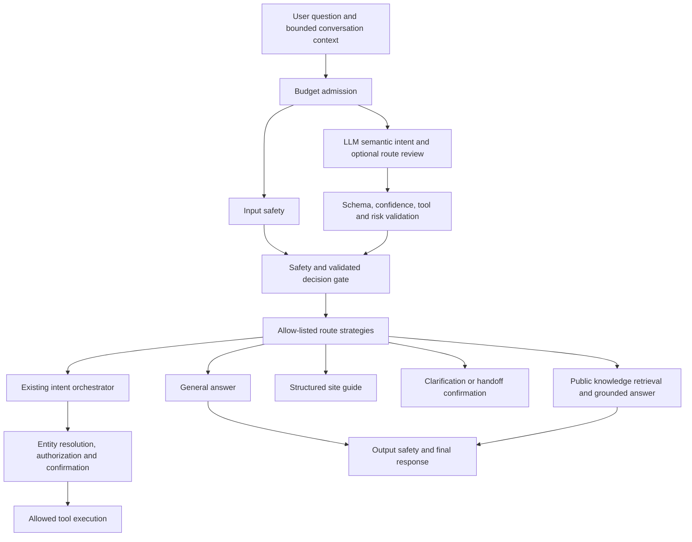
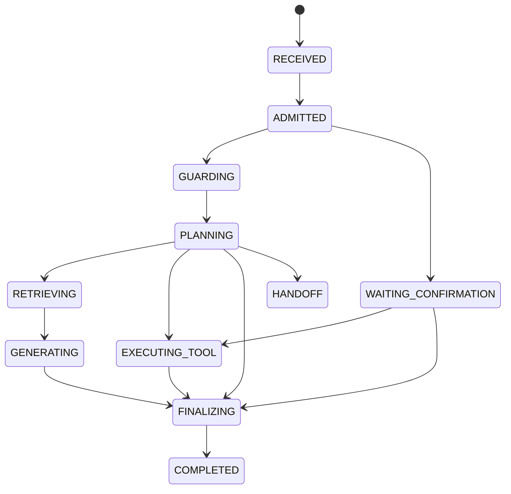

# Semantic Agent Workflow

## Responsibility boundaries

The model selects semantic intent, not permissions or executable code. The
current explicit request takes priority over conversational and page context.
Context can resolve "this article"; viewing a page never authorizes a write.
Retrieved text, attachments, and prior messages are evidence, not instructions.

## Patterns in the implementation

| Pattern | Owner | Contract |
| --- | --- | --- |
| Semantic planner | `LlmAgentRoutePlanner` | Existing classifier uses user input, recent turns, compact state and page context. No keyword-based intent routing. |
| Validation boundary | `IntentValidator` | Reject missing intent/risk, non-finite or out-of-range confidence, response/tool mismatches and invalid operational plans. |
| Strategy registry | `AgentRouteStrategies` | Select general, knowledge, guide or confirmation behavior from a validated enum. Tool routing requires a validated tool definition. Rejection takes priority over every strategy. |
| State machine | `AgentRunLifecycle` | Serialize transitions per run, reject illegal transitions, never rewind on duplicate begin, make completion idempotent. |
| Policy/command boundary | Existing `IntentOrchestrator`, `PolicyGuard`, `PendingActionStore` | The model cannot grant admin access or skip the existing staged-write confirmation flow. Existing OTP self-service tools retain their separate verification flow. |
| Ports and adapters | Existing classifier, knowledge client, tool executor and event recorder | Provider selection and external I/O remain separate from routing decisions. |

## Lifecycle

The graph summarizes common paths. Guard failures and exceptions can terminate
an active run as BLOCKED or FAILED; tool errors must not be recorded as success.
Generation and output checking now emit their actual phases. General answers
are stored as GENERAL_CHAT rather than incorrectly labeled KNOWLEDGE_QA.
State events are operational traces, not private model reasoning.

## Cost and failure behavior

- Reuses the existing Spring services; no new infrastructure or additional model
  calls introduced by this refactor. Existing optional semantic review remains.
- General questions skip portfolio retrieval unless deep mode is selected.
- Model outages return a neutral retry/clarification response without exposing
  provider exception details. Invalid model output never becomes tool execution.
- An unavailable event recorder does not prevent state cleanup or corrupt the
  active workflow. It can still cause missing observability events.
- Run state is **in-memory**, not a durable workflow engine. Process restart does
  not resume a streaming answer. Pending action persistence remains owned by the
  existing pending-action store; this is not an exactly-once execution guarantee.

## Verification and remaining work

Unit and pipeline tests exercise the actual state machine, every response
strategy, validation precedence, malformed semantic review, invalid confirmation
confidence, duplicate begin/completion, event-recorder failure and existing safety
and budget paths. Provider outputs and external services are mocked in these
tests, so they do not measure real-world intent accuracy.

Before production rollout, run a multilingual evaluation set against the real
model for general, personal, mixed, ambiguous follow-up, guide and operational
requests. Include malicious instructions in retrieved/page text, anonymous admin
requests, retrieval misses and conflicting evidence. Measure routing correctness,
citation support, latency and cost separately. Browser disconnect cancellation
and resumable generation require separate integration coverage; they are not
claimed as solved here. This refactor neither deploys services nor performs any
additional production knowledge writes.
